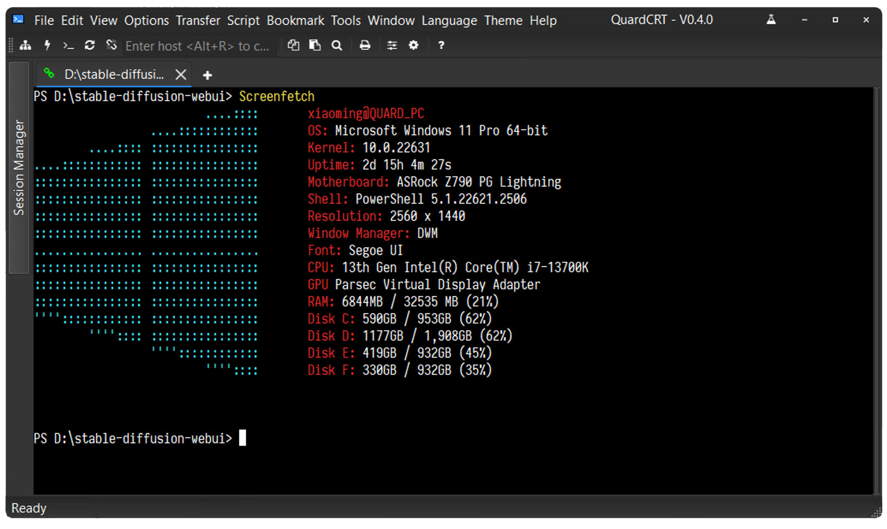
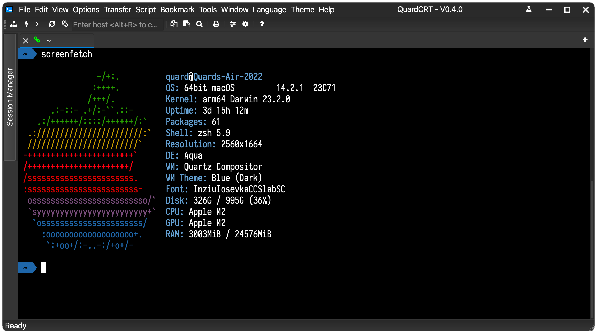
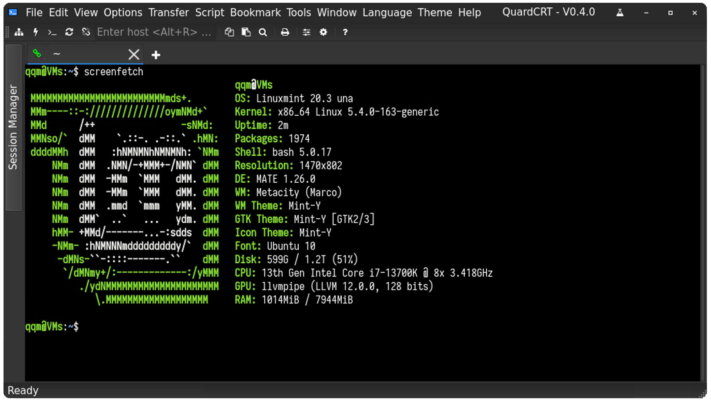

quardCRT
----------------------------------

.. image:: https://img.shields.io/github/actions/workflow/status/qqxiaoming/quardCRT/windows.yml?branch=main&logo=windows
   :target: https://github.com/QQxiaoming/quardCRT/actions/workflows/windows.yml
   :alt: Windows ci
.. image:: https://img.shields.io/github/actions/workflow/status/qqxiaoming/quardCRT/linux.yml?branch=main&logo=linux
   :target: https://github.com/QQxiaoming/quardCRT/actions/workflows/linux.yml
   :alt: Linux ci
.. image:: https://img.shields.io/github/actions/workflow/status/qqxiaoming/quardCRT/macos.yml?branch=main&logo=apple
   :target: https://github.com/QQxiaoming/quardCRT/actions/workflows/macos.yml
   :alt: Macos ci
.. image:: https://img.shields.io/codefactor/grade/github/qqxiaoming/quardCRT.svg?logo=codefactor
   :target: https://www.codefactor.io/repository/github/qqxiaoming/quardCRT
   :alt: CodeFactor
.. image:: https://readthedocs.org/projects/quardcrt/badge/?version=latest
   :target: https://quardcrt.readthedocs.io/en/latest/?badge=latest
   :alt: Documentation Status
.. image:: https://img.shields.io/github/license/qqxiaoming/quardCRT.svg?colorB=f48041&logo=gnu
   :target: https://github.com/QQxiaoming/quardCRT
   :alt: License
.. image:: https://img.shields.io/github/tag/QQxiaoming/quardCRT.svg?logo=git
   :target: https://github.com/QQxiaoming/quardCRT/releases
   :alt: GitHub tag (latest SemVer)
.. image:: https://img.shields.io/github/downloads/QQxiaoming/quardCRT/total.svg?logo=pinboard
   :target: https://github.com/QQxiaoming/quardCRT/releases
   :alt: GitHub All Releases
.. image:: https://img.shields.io/github/stars/QQxiaoming/quardCRT.svg?logo=github
   :target: https://github.com/QQxiaoming/quardCRT
   :alt: GitHub stars
.. image:: https://img.shields.io/github/forks/QQxiaoming/quardCRT.svg?logo=github
   :target: https://github.com/QQxiaoming/quardCRT
   :alt: GitHub forks
.. image:: https://gitee.com/QQxiaoming/quardCRT/badge/star.svg?theme=dark
   :target: https://gitee.com/QQxiaoming/quardCRT
   :alt: Gitee stars
.. image:: https://gitee.com/QQxiaoming/quardCRT/badge/fork.svg?theme=dark
   :target: https://gitee.com/QQxiaoming/quardCRT
   :alt: Gitee forks

********
quardCRT
********

.. toctree::
   :maxdepth: 3
   :caption: 目錄:

   安裝<installation.md>
   使用<usage.md>
   配置<configuration.md>
   常見問題<faq.md>
   貢獻<contributing.md>
   更新日誌<changelog.md>
   許可證<license.md>
   路線圖<roadmap.md>
   致謝<acknowledgements.md>
