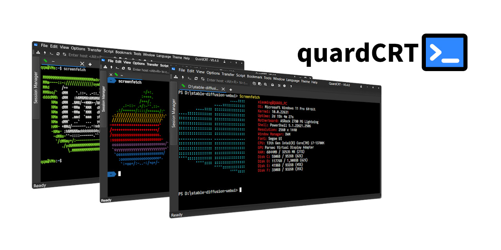

.. raw:: html

   
<a href="../../en/latest/index.html">🇺🇸 English</a> | <a href="../../zh-cn/latest/index.html">🇨🇳 简体中文</a> | <a href="../../zh-tw/latest/index.html">🇭🇰 繁體中文</a> | <a href="../../ja/latest/index.html">🇯🇵 日本語</a>

quardCRT
----------------------------------

.. image:: https://img.shields.io/github/actions/workflow/status/qqxiaoming/quardCRT/windows.yml?branch=main&logo=data:image/svg+xml;base64,PHN2ZyByb2xlPSJpbWciIHZpZXdCb3g9IjAgMCAyNCAyNCIgeG1sbnM9Imh0dHA6Ly93d3cudzMub3JnLzIwMDAvc3ZnIj48dGl0bGU+V2luZG93czwvdGl0bGU+PHBhdGggZD0iTTAsMEgxMS4zNzdWMTEuMzcySDBaTTEyLjYyMywwSDI0VjExLjM3MkgxMi42MjNaTTAsMTIuNjIzSDExLjM3N1YyNEgwWm0xMi42MjMsMEgyNFYyNEgxMi42MjMiIGZpbGw9IiNmZmZmZmYiLz48L3N2Zz4=
   :target: https://github.com/QQxiaoming/quardCRT/actions/workflows/windows.yml
   :alt: Windows ci
.. image:: https://img.shields.io/github/actions/workflow/status/qqxiaoming/quardCRT/linux.yml?branch=main&logo=linux&logoColor=white
   :target: https://github.com/QQxiaoming/quardCRT/actions/workflows/linux.yml
   :alt: Linux ci
.. image:: https://img.shields.io/github/actions/workflow/status/qqxiaoming/quardCRT/macos_arm64.yml?branch=main&logo=apple
   :target: https://github.com/QQxiaoming/quardCRT/actions/workflows/macos_arm64.yml
   :alt: Macos ci
.. image:: https://img.shields.io/codefactor/grade/github/qqxiaoming/quardCRT.svg?logo=codefactor
   :target: https://www.codefactor.io/repository/github/qqxiaoming/quardCRT
   :alt: CodeFactor
.. image:: https://img.shields.io/readthedocs/quardcrt.svg?logo=readthedocs
   :target: https://quardcrt.readthedocs.io/en/latest/?badge=latest
   :alt: Documentation Status
.. image:: https://img.shields.io/github/license/qqxiaoming/quardCRT.svg?colorB=f48041&logo=gnu
   :target: https://github.com/QQxiaoming/quardCRT
   :alt: License
.. image:: https://img.shields.io/github/v/tag/QQxiaoming/quardCRT?filter=V*&logo=git
   :target: https://github.com/QQxiaoming/quardCRT/releases
   :alt: GitHub tag (latest SemVer)
.. image:: https://img.shields.io/github/downloads/QQxiaoming/quardCRT/total.svg?logo=pinboard
   :target: https://github.com/QQxiaoming/quardCRT/releases
   :alt: GitHub All Releases
.. image:: https://img.shields.io/github/stars/QQxiaoming/quardCRT.svg?logo=github
   :target: https://github.com/QQxiaoming/quardCRT
   :alt: GitHub stars
.. image:: https://img.shields.io/github/forks/QQxiaoming/quardCRT.svg?logo=github
   :target: https://github.com/QQxiaoming/quardCRT
   :alt: GitHub forks
.. image:: https://gitee.com/QQxiaoming/quardCRT/badge/star.svg?theme=dark
   :target: https://gitee.com/QQxiaoming/quardCRT
   :alt: Gitee stars
.. image:: https://gitee.com/QQxiaoming/quardCRT/badge/fork.svg?theme=dark
   :target: https://gitee.com/QQxiaoming/quardCRT
   :alt: Gitee forks

quardCRT一款多功能終端模擬/圖形桌面軟體，支援多種後端協議，無依賴跨平台使用，windows/linux/mac使用體驗完全一致，支援多標籤頁和歷史記錄管理等傳統終端軟體功能，同時支援一些獨具特色的細節功能。quardCRT的設計宗旨是創建盡可能用戶友好、功能豐富、且跨平台一致性體驗的終端軟體，相比很多專業高性能終端，quardCRT會更適合入門、輕度用戶快速的配置好所需的終端環境，但這也並不意味quardCRT不追求高性能。

.. list-table:: 
   :widths: 33 33 33
   :header-rows: 0

   * - .. image:: ./img/windows.png
          :align: center
          :height: 160px
     - .. image:: ./img/macos.png
          :align: center
          :height: 160px
     - .. image:: ./img/linux.png
          :align: center
          :height: 160px
   * - Windows
     - MacOS
     - Linux

----------------------------------
功能
----------------------------------

- **跨平台**: Windows, MacOS, Linux
- **多種協議**: SSH, Telnet, Serial, LocalShell, RawSocket, NamedPipe, VNC
- **多會話**: 多標籤，多窗口，多監視器，浮動窗口
- **多語言**: 簡體中文，繁體中文，英語，日語，韓語，西班牙語，法語，俄語，德語，葡萄牙語(巴西)，捷克語，阿拉伯語
- **多主題**: 亮色，暗色
- **會話歷史管理**: 會話歷史管理，會話歷史搜索
- **會話管理**: 會話管理，會話導入導出
- **HEX顯示**: HEX顯示
- **文件傳輸**: SFTP, Xmodem, Ymodem, Zmodem, Kermit
- **腳本**: 腳本錄製，腳本回放
- **終端定制**: 終端字體，顏色，大小，光標，回滾，背景等

----------------------------------
特別功能
----------------------------------

- 標籤浮動預覽
- 支持浮動窗口，標籤拖拽到浮動窗口
- SSH2會話一鍵打開SFTP文件傳輸窗口
- 工作目錄書籤
- 自動發送
- 終端背景圖支持gif動畫和視頻
- 終端關鍵字高亮匹配
- 選中文本翻譯功能
- 路徑匹配一鍵直達
- 工作路徑直達
- Windows本地終端增強（Tab鍵選擇完整命令等）
- 廣播會議
- 會話標籤標記顏色
- 區塊選擇（Shift+點擊）和列選擇（Alt+Shift+點擊）

----------------------------------
插件
----------------------------------

quardCRT從V0.4.0版本開始支持插件，插件將以Qt插件的形式提供，以動態庫的形式加載，關於插件開發信息的更多了解，請參考插件開放平台 `platform <https://github.com/QuardCRT-platform>`_ 。該平台將提供插件開發的模板倉庫和相關示例。目前插件功能還處於早期開發階段，如果您有好的想法或建議，請在 `GitHub <https://github.com/QQxiaoming/quardCRT>`_ 或 `Gitee <https://gitee.com/QQxiaoming/quardCRT>`_ 上提交issues或討論。

----------------------------------
從商店安裝
----------------------------------

.. image:: https://get.microsoft.com/images/zh-tw%20dark.svg
   :target: https://apps.microsoft.com/detail/quardCRT/9p6102k9qb3t?mode=direct
   :alt: Microsoft Store

----------------------------------
捐赠
----------------------------------

如果您覺得本項目對您有幫助，您可以通過以下方式捐赠：

.. list-table:: 
   :widths: 33 33 33
   :header-rows: 0

   * - .. image:: ./img/donate/paypal.jpg
          :align: center
     - .. image:: ./img/donate/alipay.jpg
          :align: center
     - .. image:: ./img/donate/wechat.jpg
          :align: center
   * - paypal
     - alipay
     - wechat

.. toctree::
   :maxdepth: 3
   :caption: 目錄:

   安裝<installation.md>
   使用<usage.md>
   配置<configuration.md>
   腳本<scripts.md>
   插件<plugins.md>
   常見問題<faq.md>
   貢獻<contributing.md>
   更新日誌<changelog.md>
   許可證<license.md>
   路線圖<roadmap.md>
   致謝<acknowledgements.md>
   隱私<privacy.md>
