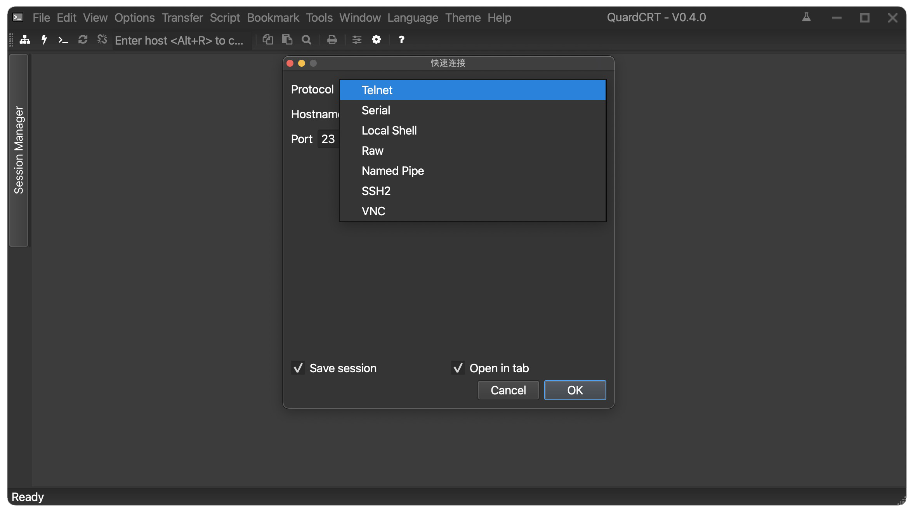

<a href="../../en/latest/usage.html">🇺🇸 English</a> | <a href="../../zh-cn/latest/usage.html">🇨🇳 简体中文</a> | <a href="../../zh-tw/latest/usage.html">🇭🇰 繁體中文</a> | <a href="../../ja/latest/usage.html">🇯🇵 日本語</a>

# 使用

本頁介紹安裝完成後最常用的介面結構與基礎操作。

quardCRT 以已儲存工作階段與基於分頁的終端工作流程為核心。多數使用者會先開啟一個快速連線，視情況將其儲存為工作階段，之後再調整全域外觀與終端設定。

## 主介面概覽

主介面主要由以下幾個區域組成：

- 選單列：完整存取所有命令與設定。
- 工具列：快速存取常用操作。
- 側邊欄：工作階段管理器與外掛區域。
- 分頁：一個或多個活動工作階段。
- 終端區域：目前活動終端或遠端桌面內容。
- 狀態列：狀態與提示資訊。

## 上手時可先做什麼

### 快速連線

如果你想先開啟一個一次性的連線，而不立即建立完整的已儲存工作階段，可使用 `檔案 > 快速連線`。選擇協議、填寫必要的連線資訊，然後在目前視窗或新分頁中開啟。

### 已儲存工作階段

左側邊欄中的工作階段管理器可用於瀏覽已儲存工作階段、重新連線最近目標，以及按資料夾整理條目。對於經常使用的 SSH、序列埠、Raw Socket 或 VNC 目標，建議使用已儲存工作階段管理。

### 本地終端

如果你只需要開啟本地 shell，可使用 `檔案 > 連接本地終端`。這會在目前機器上新增一個本地終端分頁。

### 外觀與語言

`主題` 與 `語言` 選單適合快速切換介面外觀。若要進一步調整字型、背景圖、游標樣式或傳輸目錄，可開啟 `選項 > 全域選項`。

## 其他建議閱讀

- [配置](./configuration.md)：進一步調整字型、主題、回捲緩衝區、傳輸目錄與高級選項
- [腳本](./scripts.md)：如果你想使用自動化能力
- [插件](./plugins.md)：如果你想透過 Qt 外掛擴充 quardCRT

